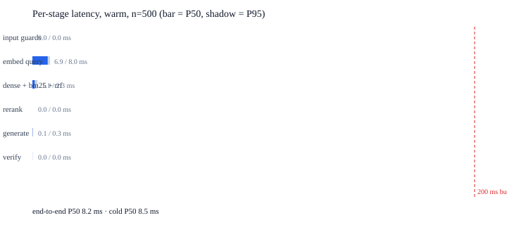

# D3 - Latency analytics

| field | value |
|---|---|
| machine | arm64 / 10 vCPU |
| region | local |
| provider | Darwin |
| date | 2026-08-18 17:28 IST |
| commit | 4433cea |
| embedder | intfloat/multilingual-e5-small / 384d |
| python | 3.13.7 |
| seed | 42 |
| n | 500 |
| budget | 200 ms |


> **200 ms budget: PASS.** 1500/1500 requests inside the window across every mode (warm 0/500, cold 0/500, conc 0/500 over budget). Slowest single request 176.4 ms. Excluded legs are listed below and are not part of this verdict.


## The window

```
  [ mic + VAD ]   [ STT round trip ]   |=== t0 ---> t1 MEASURED ===|   [ TTS + net ]
     excluded          excluded          guards -> retrieve -> rerank      excluded
                                         -> generate -> verify
  t0 = server receives the STT is_final event, stamped server-side
  t1 = last answer token flushed to the socket, after the grounding verdict
```

excluded legs (P50 / P95 / P100, ms): STT 520.7 / 856.5 / 856.5 over 6 clips via sarvam:batch    TTS 793.2    client RTT _    (`_` = no such stage in this repo, or not measured)


## Table shape - warm, n = 500

| stage             |  P50 |  P70 |  P95 | P100 |
|-------------------|------|------|------|------|
| input guards      | 0.01 | 0.01 | 0.02 | 0.03 |
| embed query       | 9.07 | 9.56 | 10.71 | 15.43 |
| dense + bm25 + rrf | 1.38 | 2.01 | 3.15 | 4.28 |
| rerank            | 20.93 | 29.38 | 40.23 | 43.92 |
| generate          | 14.31 | 17.63 | 24.59 | 90.56 |
| verify            | 0.05 | 0.06 | 0.08 | 0.24 |
| END-TO-END (warm) | 45.21 | 53.88 | 69.61 | 136.03 |
| END-TO-END (cold) | 49.03 | 56.43 | 74.04 | 134.68 |

degradation rate: 0.0%   cache hit rate: 9.8%   n=500, seed 42   over-budget: 0/500 (0.0%)


> 9.8% of warm queries hit the semantic cache. The cache-off cold row is published beside the warm one; read it as the cost of a first-time question.


## P100, said out loud

P100 over 500 samples is one observation: it is the max and it is unstable by construction. P95 = 69.6 ms, P99 = 80.1 ms, P100 = 136.0 ms. P100 = 136.0 ms on `s077` (spoken, hi); the dominant stage was **generate** at 90.6 ms, fallbacks fired: none.


## Concurrency

A separate `--concurrency 4` pass over the same 500 queries: P50 114.5 ms, P95 155.5 ms, over-budget 0/500.





_All stages are milliseconds. The `embed query` and `rerank` rows are real transformer forward passes (multilingual-e5-small and a mMiniLMv2-L12 cross-encoder, both on CPU). Generation is still extractive, so that row is a floor rather than an LLM's cost: budget the generator's own time on top of it. The `rerank` row is the reranks that RAN -- a request whose lanes were busy or whose deadline expired logs `rerank_skipped` and serves the fused order, which is why the warm P50 here sits near the stage's solo cost while the concurrency pass is slower._


_Cold = fresh process, semantic cache off, encoder already resident: a server loads its model before it accepts traffic, so that ~10 s belongs to startup and not to the first caller's 200 ms. Warm = 50 discarded warmups first, cache on; the cache-off run is the `cold` row and the cache hit rate is printed above, so a repeat-heavy query file cannot flatter the P50 unnoticed._
